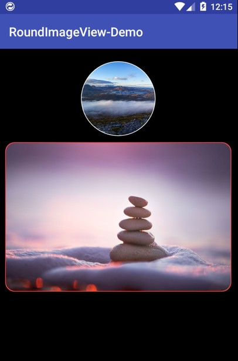

## RoundImageView

RoundImageView is a library that displays round corner picture and circle image for Android.

 

## Getting started

As an jcenter library, you just need to add dependencies by adding the following lines to your `app/build.gradle`.

```gradle
dependencies {
    implementation 'android.denchopen:roundimageview:{version}' // version could be update to the online lastest,current is 0.1.2
}
```

Then you can just use CircleImageView display circle pictures and RoundImageView display round corner pictures.

```xml
<android.denchopen.roundimageview.CircleImageView
    ...
    app:border="1dp"
    app:border_color="@android:color/white" />

<android.denchopen.roundimageview.RoundImageView
    ...
    app:border="1dp"
    app:border_color="@android:color/holo_red_light"
    app:radius="15dp" />
```

## Support
Any problem?

1. Learn more from [RoundImageView-Demo](https://github.com/DenchOpen/RoundImageView-Demo).
2. Read the [source code](https://github.com/DenchOpen/RoundImageView-Demo/tree/master/roundimageview).
3. Contact us for help.

## License
RoundImageView is under the Apache Software Foundation (ASF) License. See the [LICENSE](LICENSE) file for details.
